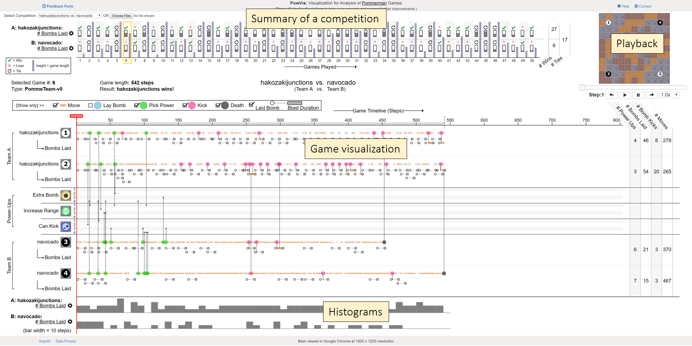

# Bombalytics



The Bombalytics approach visualizes gameplay strategies of AI agents competiting and collaborating with each other in the [Pommerman](https://www.pommerman.com/) environment.

# Citation:

The visualization approach has been published in a peer-reviewed conference. To cite the article:

Agarwal, S., Wallner, G. and Beck, F. (2020), Bombalytics: Visualization of Competition and Collaboration Strategies of Players in a Bomb Laying Game. Computer Graphics Forum, 39: 89-100. [https://doi.org/10.1111/cgf.13965](https://doi.org/10.1111/cgf.13965)

```
@article{Agarwal2020Bombalytics,
author = {Agarwal, Shivam and Wallner, Guenter and Beck, Fabian},
title = {Bombalytics: Visualization of Competition and Collaboration Strategies of Players in a Bomb Laying Game},
pages = {89--100},
journal = {Computer Graphics Forum},
volume = {39},
number = {3},
issn = {1467-8659},
doi = {10.1111/cgf.13965},
abstract = {Competition and collaboration form complex interaction patterns between the agents and objects involved. Only by understanding these interaction patterns, we can reveal the strategies the participating parties applied. In this paper, we study such competition and collaboration behavior for a computer game. Serving as a testbed for artificial intelligence, the multiplayer bomb laying game Pommerman provides a rich source of advanced behavior of computer agents. We propose a visualization approach that shows an overview of multiple games, with a detailed timeline-based visualization for exploring the specifics of each game. Since an analyst can only fully understand the data when considering the direct and indirect interactions between agents, we suggest various visual encodings of these interactions. Based on feedback from expert users and an application example, we demonstrate that the approach helps identify central competition strategies and provides insights on collaboration.},
url = {https://dx.doi.org/doi:10.1111/cgf.13965},
year = {2020}
}
```

# Installation

To run the prototype, open index.html in desktop browser.

For best performance use Google Chrome browser at 1920 x 1080 resolution screen.

# Demo and Details

For a live demo of the approach and details of the approach, please visit [this page](https://s-agarwl.github.io/publication/Agarwal2020Bombalytics).