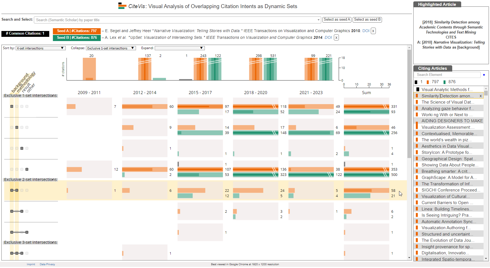

# CiteVis: Visual Analysis of Overlapping Citation Intents as Dynamic Sets

A visualization approach to explore the overlapping citation intents.



# Citation:

The visualization approach has been published as a poster in a peer-reviewed conference. To cite the article:

Shivam Agarwal, Uttiya Ghosh, Fabian Beck, Jaya Sreevalsan-Nair, "CiteVis: Visual Analysis of Overlapping Citation Intents as Dynamic Sets" In the proceedings of IEEE Pacific Visualization Symposium (PacificVis - Poster), 2022.

```
@inproceedings{Agarwal2022CiteVis,
author = {Agarwal, Shivam and Ghosh, Uttiya and Beck, Fabian and Sreevalsan-Nair, Jaya},
booktitle = {IEEE Pacific Visualization Symposium ({PacificVis} - Poster)},
title = {{CiteVis}: Visual Analysis of Overlapping Citation Intents as Dynamic Sets},
abstract = {A scientific article can be cited with different intents over several years. The citation intents can be inferred by classifying the citation text into different categories. With multiple citations to the same article, the citation intent categories overlap, making their analysis more challenging. We model the categories as dynamic sets and propose an approach to visualize temporal citation trends of an article across overlapping citation intents. The approach supports comparison between the citation trends of two seed articles of interest. The implemented prototype supports searching and selecting seed articles from a Semantic Scholar dataset.},
year = {2022}
}
```

# Installation

To run the prototype, start a local web-server and open index.html in desktop browser.

For best performance use Google Chrome browser at 1920 x 1080 resolution screen.

# Demo and Details

Live demo of the approach can be found [here](https://vis-uni-bamberg.github.io/citevis/), while for pdf of the research article, and the poster, please visit [this page](https://s-agarwl.github.io/publication/Agarwal2022CiteVis).
