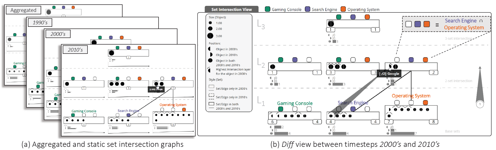

# Visualizing Sets and Changes in Membership Using Layered Set Intersection Graphs

A dynamic set visualization approach.



# Citation:

The visualization approach has been published in a peer-reviewed conference. To cite the article:

Agarwal, S., Tkachev, G., Wermelinger, M. and Beck, F., 2020. Visualizing Sets and Changes in Membership Using Layered Set Intersection Graphs. VMV: Vision, Modeling, and Visualization, pp.69-78. doi:[10.2312/vmv.20201189](https://doi.org/10.2312/vmv.20201189)

```
@inproceedings{Agarwal2020VisualizingSets,
author = {Agarwal, Shivam and Tkachev, Gleb and Wermelinger, Michel and Beck, Fabian},
title = {Visualizing Sets and Changes in Membership Using Layered Set Intersection Graphs},
booktitle = {Vision, Modeling, and Visualization},
doi = {doi:10.2312/vmv.20201189},
abstract = {Challenges in set visualization include representing overlaps among sets, changes in their membership, and details of constituent elements. We present a visualization technique that addresses these challenges. The approach uses set intersection graphs that explicitly visualize each set intersection as a rectangular node and elements as circles inside them. We represent the graph as a layered node-link diagram using colors to indicate the sets. The layers reflect different levels of intersections, from the base sets in the lowest layer to potentially the intersection of all sets in the highest layer. We provide different perspectives to show temporal changes in set membership. Graphs for individual, two, and all timesteps are visualized in static, diff, and aggregated views. Together with linked views and filters, the technique supports the detailed exploration of dynamic set data. We demonstrate the effectiveness of the proposed approach by discussing two application examples. The submitted supplemental material contains a video showing proposed interactions in the implementation and the prototype itself.},
url = {https://dx.doi.org/doi:10.2312/vmv.20201189},
year = {2020}
}
```

# Installation

To run the prototype, start a local web-server and open index.html in desktop browser.

For best performance use Google Chrome browser at 1920 x 1080 resolution screen.

# Demo and Details

Live demo of the approach can be found [here](https://vis-uni-bamberg.github.io/dsv/), while for pdf of the research article, and video of the conference presentation, please visit [this page](https://s-agarwl.github.io/publication/Agarwal2020VisualizingSets).
