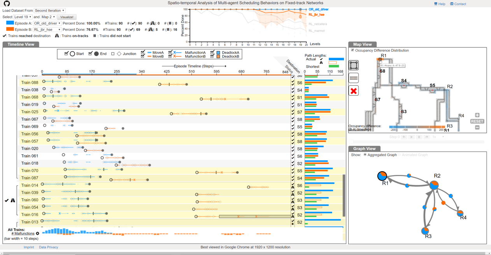

# Spatio-temporal Analysis of Multi-agent Scheduling Behaviors on Fixed-track Networks

The visualization approach aims to help AI developers to explore the spatio-temporal collaborative movement behavior of AI agents on a fixed-track netowork environment [Flatland](https://flatland.aicrowd.com/intro.html) environment.



# Citation:

The visualization approach has been published in a peer-reviewed conference. To cite the article:

S. Agarwal, G. Wallner, J. Watson and F. Beck, "Spatio-temporal Analysis of Multi-agent Scheduling Behaviors on Fixed-track Networks," 2022 IEEE 15th Pacific Visualization Symposium (PacificVis), 2022, pp. 21-30, doi: [10.1109/PacificVis53943.2022.00011](https://doi.org/10.1109/PacificVis53943.2022.00011).

```
@inproceedings{Agarwal2022Spatio,
author = {Agarwal, Shivam and Wallner, Günter and Watson, Jeremy and Beck, Fabian},
title = {Spatio-temporal Analysis of Multi-agent Scheduling Behaviors on Fixed-track Networks},
abstract = {Multi-agent systems require coordination among the agents to solve a given task. For movement on fixed-track networks, traditional scheduling algorithms have dominated so far, but the interest in autonomous and intelligent agents is growing as they promise to react to unexpected and exceptional situations more robustly. In this paper, we study data from the Flatland 2020 NeurIPS Competition, where trains move through a virtual rail network. We developed a timeline-based visualization that provides an overview of all train movements in a simulated episode, clearly hinting at different phases, non-optimal routes, and issues such as deadlocks. This view is complemented with a map view and a graph view, interactively linked through highlighting and synchronous animation. Defining regions of interest in the map builds an analysis graph for detailed inspection. A comparison mode allows contrasting two different episodes regarding the same rail network across all views. We have conducted this application study in close collaboration with the Flatland community. Identified analysis goals stem from interviews with key persons of the community, while the approach itself was developed in two iterations based on feedback from experts with diverse backgrounds. This feedback, together with an analysis of the winning submissions from the competition, confirms that the initial analysis goals can be answered.},
year = {2022},
booktitle = {IEEE Pacific Visualization Symposium (PacificVis)},
doi = {10.1109/PacificVis53943.2022.00011},
pages={21-30},
ISSN={2165-8773}
}
```

# Installation

To run the prototype, start a local web-server and open index.html in desktop browser.

For best performance use Google Chrome browser at 1920 x 1080 resolution screen.

# Demo and Details

Live demo of the approach can be found [here](https://vis-uni-bamberg.github.io/fv/), while for pdf of the research article, and video of the conference presentation, please visit [this page](https://s-agarwl.github.io/publication/Agarwal2022Spatio).
