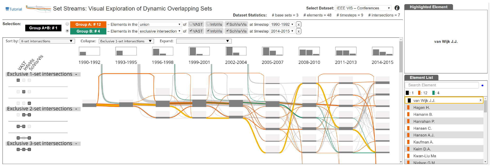

# Set Streams: Visual Exploration of Dynamic Overlapping Sets

A visualization approach to explore dynamic overlapping sets.



# Citation:

The visualization approach has been published in a peer-reviewed conference. To cite the article:

Agarwal, S. and Beck, F. (2020), Set Streams: Visual Exploration of Dynamic Overlapping Sets. Computer Graphics Forum, 39: 383-391. https://doi.org/10.1111/cgf.13988

```
@article{Agarwal2020SetStreams,
author = {Agarwal, Shivam and Beck, Fabian},
title = {{Set Streams}: Visual Exploration of Dynamic Overlapping Sets},
pages = {383--391},
journal = {Computer Graphics Forum},
volume = {39},
number = {3},
issn = {1467-8659},
doi = {doi:10.1111/cgf.13988},
abstract = {In many applications, membership of set elements changes over time. Since each element can be present in multiple sets, the sets also overlap. As a result, it becomes challenging to visualize the temporal change in set membership of elements across several timesteps while showing individual set intersections. We propose Set Streams, a visualization technique that represents changing set structures on a timeline as branching and merging streams. The streams encode the changing membership of elements with set intersections. A query-based selection mechanism supports a flexible comparison of selected groups of elements across the temporal evolution. The main timeline view is complemented with additional panels to provide details about the elements. While the proposed visualization is an application-independent visualization technique for dynamic sets, we demonstrate its effectiveness and applicability through three diverse application examples and expert feedback.},
url = {https://dx.doi.org/doi:10.1111/cgf.13988},
year = {2020}
}
```

# Installation

To run the prototype, start a local web-server and open index.html in desktop browser.

For best performance use Google Chrome browser at 1920 x 1080 resolution screen.

# Demo and Details

Live demo of the approach can be found [here](https://vis-uni-bamberg.github.io/setstreams/), while for pdf of the research article, and the conference presentation, please visit [this page](https://s-agarwl.github.io/publication/Agarwal2020SetStreams).
